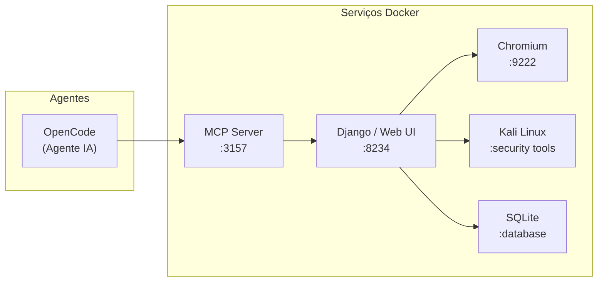

# AutoQA

**Kit de testes dockerizado com Chromium headless, Kali Linux, plataforma de gerenciamento de testes e integração via MCP para agentes de IA.**

AutoQA é uma plataforma local-first para gerenciamento e acompanhamento de ciclos de teste (QA e segurança). Ela fornece APIs estruturadas, ferramentas MCP e uma interface web com HTMX para que agentes de IA (Claude Code, Codex, Qwen, etc.) e desenvolvedores humanos possam orquestrar testes de forma colaborativa.

> AutoQA é um **rastreador de estado** — ele não controla navegadores, analisa código ou executa testes diretamente. Agentes se conectam ao Chrome CDP de forma independente e reportam resultados via MCP/REST.

## Conteúdo

- [Stack](#stack)
- [Arquitetura](#arquitetura)
- [Instalação](#instalação)
- [Configuração do OpenCode](#configuração-do-opencode)
- [Agentes e Comandos](#agentes-e-comandos)
- [Testes de Segurança](#testes-de-segurança)
- [API & MCP](#api--mcp)
- [Docker Services](#docker-services)
- [Comandos Úteis](#comandos-úteis)
- [Escopo](#escopo)

## Stack

| Camada | Tecnologia |
|--------|-----------|
| Backend | Django 5.1 + Django REST Framework |
| Banco de dados | SQLite3 |
| Frontend | Django Templates + HTMX + Tailwind CSS |
| MCP Server | FastMCP (streamable-http) |
| Navegador | Chromium headless (Selenium) com CDP |
| Segurança | Kali Linux (kalilinux/kali-rolling) |

## Arquitetura



## Instalação

### Requisitos

- Docker & Docker Compose
- Node.js (para Tailwind CSS)
- npx (via npm)

### Setup rápido

```bash
bash setup.sh
```

O script `setup.sh` realiza toda a configuração inicial:

1. Inicia os containers via Docker Compose
2. Executa migrations do Django
3. Cria o usuário superuser interativamente
4. Gera uma chave de API para o agente
5. Registra automaticamente os agentes e comandos no config do OpenCode (`~/.config/opencode/config.json`)

### Configuração do OpenCode

Além dos agentes nativos do AutoQA, o agente precisa do **Chrome DevTools MCP** para realizar testes avançados no navegador. Adicione o seguinte bloco dentro da chave `"mcp"` no arquivo de configuração do OpenCode:

```json
"chrome-devtools": {
  "type": "local",
  "enabled": true,
  "command": [
    "npx",
    "-y",
    "chrome-devtools-mcp@latest",
    "--browser-url=http://127.0.0.1:9222"
  ]
}
```

## Agentes e Comandos

A pasta `agents/` contém personas e comandos para o OpenCode:

### Agentes

| Arquivo | Descrição |
|---------|-----------|
| `QA_Analyst.md` | Agente de análise de testes funcionais (QA) |
| `SecurityAnalyst.md` | Agente de análise de segurança — descoberta via código-fonte |
| `BlackBoxAnalyst.md` | Agente de análise black-box — descoberta via Chrome DevTools |

### Comandos

| Arquivo | Comando |
|---------|---------|
| `runqa.md` | `/runqa` — Executa testes funcionais (QA) |
| `runsecurity.md` | `/runsecurity` — Executa avaliação de segurança (codebase-based) |
| `runblackbox.md` | `/runblackbox` — Executa avaliação black-box |

Os arquivos de agente usam iniciais maiúsculas, enquanto os comandos usam iniciais minúsculas, seguindo a convenção de nomenclatura do OpenCode.

## Testes de Segurança

O AutoQA suporta dois modos de avaliação de segurança:

| Modo | Agente | Método de Descoberta | Melhor Para |
|------|--------|---------------------|-------------|
| **Codebase-based** | SecurityAnalyst | Lê código-fonte via subagent `@explore` | Projetos com acesso ao filesystem |
| **Black-box** | BlackBoxAnalyst | Chrome DevTools + análise de JS | Aplicações deployed, sistemas de terceiros |

### Rotina de Segurança (6 Fases)

1. **Reconnaissance** — nmap, whatweb, httpx, subfinder
2. **Vulnerability Assessment** — nuclei, gobuster, ffuf, nikto
3. **Authentication Testing** — hydra (rate-limited), análise de sessões
4. **Input Validation** — sqlmap (read-only), testes manuais XSS/XXE
5. **Configuration Security** — testssl, análise de headers, CORS
6. **Reporting** — síntese de findings em incidents

### Constraints de Segurança

- Modo read-only (sqlmap `--batch --crawl`, sem módulos de exploit)
- Rate-limited (hydra max 3 threads)
- Sem ações destrutivas (sem exclusão de dados, sem privilege escalation)
- Whitelist de alvos obrigatória

## API & MCP

### Endpoints REST

Todas as operações expostas via DRF viewsets sob `/api/`:

| Resource | Endpoints |
|----------|-----------|
| TestPlan | CRUD completo |
| TestStep | CRUD (ordenado por `order_index`) |
| TestRun | Create, list, complete |
| RunStepResult | Create (log de resultado) |
| Incident | CRUD |
| APIKey | CRUD (superuser) |

**Autenticação:** Session (UI web) ou API Key (`rest_framework_api_key`) para agentes/MCP.

### Chrome Connection

```
GET /api/chrome-connection/
```

Retorna: `{ "connection_string": "ws://...", "host": "...", "port": 9222 }`

### MCP Tools

| Tool | Descrição |
|------|-----------|
| `create_test_plan(...)` | Cria um novo plano de teste |
| `get_test_plans(...)` | Lista planos de teste |
| `get_test_steps(plan_id)` | Lista etapas de um plano |
| `create_test_run(plan_id)` | Inicia um execution run |
| `log_step_result(run_id, step_id, status)` | Registra resultado de etapa |
| `create_incident(...)` | Cria um incident a partir de falha |
| `run_security_scan(target, phase, tools, run_id)` | Executa ferramentas de segurança via Kali |
| `get_security_report(run_id)` | Retorna resultados do scan |
| `get_kali_status()` | Verifica saúde do container Kali |

## Docker Services

| Serviço | Imagem | Porta | Descrição |
|---------|--------|-------|-----------|
| `web` | Custom (Dockerfile) | 8234 | Django + gunicorn |
| `mcp_server` | Custom (Dockerfile) | 3157 | FastMCP streamable-http |
| `chrome` | `selenium/standalone-chromium` | 9222, 4444, 7900 | Chromium com CDP |
| `kali` | `kalilinux/kali-rolling` | — | Tools de segurança (sem porta exposta) |

O volume compartilhado `./security_output` armazena os resultados dos scans.

## Comandos Úteis

| Tarefa | Comando |
|--------|---------|
| Executar testes | `python manage.py test` |
| Teste único | `python manage.py test core.tests.TestPlanModelTest` |
| Migrations | `python manage.py migrate` |
| Build CSS | `npm run build:css` |
| Watch CSS | `npm run watch:css` |
| Collect static | `python manage.py collectstatic --noinput` |
| Full stack Docker | `docker compose up --build` |

## Escopo

### Incluído

- Gerenciamento de planos, etapas, runs e incidents
- Interface web com HTMX e Tailwind CSS
- MCP server para integração com agentes de IA
- Container Chromium headless com remote debugging
- Container Kali Linux com ferramentas de segurança
- API REST com autenticação por API key

### Não incluído

- Automação de browser ou gerenciamento de CDP sessions
- Análise de AST ou parsing de código
- Celery, Redis ou filas de tarefas
- Atualizações em tempo real via WebSocket
- Multi-tenancy ou deploy em cloud
- Lógica de execução de testes ou decisão de pass/fail
- Desenvolvimento de exploits ou geração de payloads
